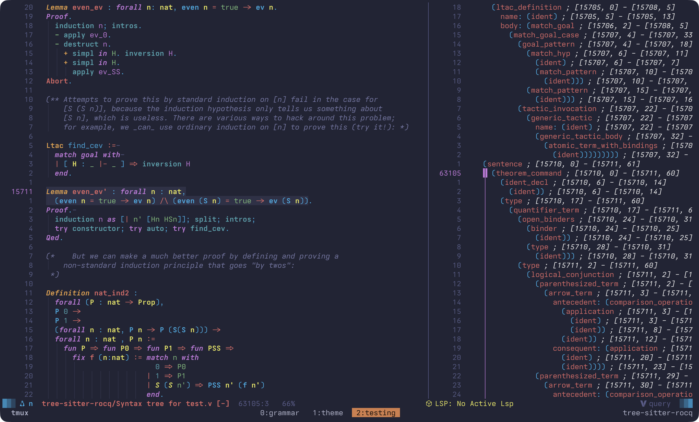

# tree-sitter-rocq

[Rocq](https://rocq-prover.org/) (formerly Coq) grammar for [tree-sitter](https://github.com/tree-sitter/tree-sitter).

The grammar is modeled around concepts from the [Software Foundations (SF) Series](https://softwarefoundations.cis.upenn.edu/).

## Scope and Limitations

1. Rocq's custom `Notation` system makes 100% static syntax coverage practically
impossible (see the official [reference manual](https://rocq-prover.org/doc/V9.0.0/refman/language/core/basic.html)).
2. The scope focuses on constructs encountered during practical study rather than
exhaustive language coverage.
3. The main purpose is to enable syntax highlighting using
[Tree-sitter queries](https://tree-sitter.github.io/tree-sitter/3-syntax-highlighting.html).

> [!NOTE]
> This project is experimental and actively evolving, so breaking changes may
> happen between commits.

## Current State and Workflow

The current grammar generates a solid CST for features covered in
[Software Foundations, Volume 1 (Logical Foundations)](https://softwarefoundations.cis.upenn.edu/lf-current/index.html).

As I work through
[Volume 2 (Programming Language Foundations)](https://softwarefoundations.cis.upenn.edu/plf-current/index.html),
I consult the [reference manual](https://rocq-prover.org/doc/V9.2.0/refman/index.html)
and add rules for new language features as I encounter them.

## Usage

If you're using Neovim, you can install and configure this parser using
[nvim-tree-sitter](https://github.com/nvim-treesitter/nvim-treesitter). For other
editors, consult the
[Tree-sitter documentation](https://tree-sitter.github.io/tree-sitter).

### Highlight Groups

To see an example of the highlight groups in action, check out my personal
[Neovim configuration](https://github.com/aruzdh/.dotfiles/blob/84096d91163287632c2a639a4ff6f8c59de498d3/nvim/.config/nvim/lua/aru/plugins/ui/theme.lua).

## Known Issues and Notes (SF, Vol. 1)

| Feature / Rule | Not Impl. | Untested | Missing Feature | Incomplete | Custom | Notes and Refs |
| :--- | :---: | :---: | :---: | :---: | :---: | :--- |
| **`Eval`** | ● | | | | | [ref](https://rocq-prover.org/doc/V9.2.0/refman/proofs/writing-proofs/equality.html#rocq:cmd.Eval). |
| **`Extraction`** | | ● | | | | [ref](https://rocq-prover.org/doc/V9.2.0/refman/addendum/extraction.html#rocq:cmd.Extraction). |
| **`Coercion`** | | | | ● | | Only the `coercion_class` variant is implemented ([ref](https://rocq-prover.org/doc/V9.0.0/refman/addendum/implicit-coercions.html#coq:cmd.Coercion)). |
| **`_def_body`** | | | ● | | | Missing the optional `reduce` rule ([ref](https://rocq-prover.org/doc/V9.0.0/refman/language/core/definitions.html#coq:cmd.Theorem)). |
| **`Inductive`** | | | | ● | | Missing secondary variant and optional `cumul_univ_decl` rule ([ref](https://rocq-prover.org/doc/V9.0.0/refman/language/core/inductive.html#coq:cmd.Inductive)). |
| **`Arguments`** | | | | ● | | [ref](https://rocq-prover.org/doc/V9.0.0/refman/language/extensions/arguments-command.html#coq:cmd.Arguments). |
| **`Module`** | | | | ● | | [ref](https://rocq-prover.org/doc/V9.0.0/refman/language/core/modules.html#coq:cmd.Module). |
| **`binder`** | | | ● | | | Missing `generalizing_binder` support ([ref](https://rocq-prover.org/doc/V9.0.0/refman/language/core/assumptions.html#grammar-token-binder)). |
| **`_for_each_goal`** | | | | ● | | [ref](https://rocq-prover.org/doc/V9.2.0/refman/proof-engine/ltac.html#grammar-token-for_each_goal). |
| **`ident_decl`** | | | ● | | | Missing optional `univ_decl` ([ref](https://rocq-prover.org/doc/V9.2.0/refman/language/core/assumptions.html#grammar-token-ident_decl)). |
| **`assert`** | | | ● | | | Uses a variant of [as_ipat](https://rocq-prover.org/doc/V9.2.0/refman/proof-engine/tactics.html#grammar-token-as_ipat). |
| **`in_clause`** | | | | ● | | Variant of [occurrences](https://rocq-prover.org/doc/V9.2.0/refman/proof-engine/tactics.html#grammar-token-occurrences). |
| **`as_clause`** | | | | ● | | Variant of [as_ipat](https://rocq-prover.org/doc/V9.2.0/refman/proof-engine/tactics.html#grammar-token-as_ipat). |
| **`intro_pattern`** | | | | ● | | Variant of [intropattern](https://rocq-prover.org/doc/V9.2.0/refman/proof-engine/tactics.html). |
| **`pattern`** | | | | ● | | Variant of [pattern](https://rocq-prover.org/doc/V9.2.0/refman/language/core/variants.html#definition-by-cases-match). |
| **`term`** | | | | ● | | Variant of [term](https://rocq-prover.org/doc/V9.2.0/refman/language/core/basic.html#grammar-token-term). |
| **Imp Notations** | | | | | ● | Minimal rules added specifically for SF [Imp](https://softwarefoundations.cis.upenn.edu/lf-current/Imp.html) chapters. |
| **Term Application** | | | | | ● | Implemented via left-recursive terms rather than the official list of `args` ([ref](https://rocq-prover.org/doc/V9.2.0/refman/language/core/assumptions.html#grammar-token-term_application)). |
| **Tactics, Tacticals, and Ltac** | | | | | ● | Uses a generalized tactic rule; tacticals support a minimal set (`repeat`, `try`); ltac is defined in terms of `_ltac_expr` rule ([ref](https://rocq-prover.org/doc/V9.2.0/refman/proof-engine/ltac.html#grammar-token-ltac_expr)). |
| **`Hint`** | | | | | ● | Uses a generalized version of the [official rule](https://rocq-prover.org/doc/V9.2.0/refman/proofs/automatic-tactics/auto.html). |
| **`evaluation_command`** | | | | | ● | Uses a unified rule to cover `Check`, `Compute`, `Print`, `Search`, and `Locate`. |

## Context & Motivation

While [Coqtail](https://github.com/whonore/Coqtail) syntax highlighting has been
around for years, this project is meant to build on top of the existing ecosystem.

I used Coqtail for a while, but its reliance on heavy Vim script regex noticeably
slowed down my editor—even when just typing whitespace.

Other alternatives like the official
[VS Code extension](https://github.com/rocq-prover/vsrocq) don't quite deliver a
rich syntax highlighting experience compared to other languages (not to mention
it's built for VS Code, and colors look a bit flat). Meanwhile, plugins like
[vsrocq.nvim](https://github.com/tomtomjhj/vsrocq.nvim) leave out syntax highlighting.

### Beyond Syntax Highlighting

While syntax highlighting is the main focus, having a concrete CST opens up a lot
of other possibilities (like custom text-objects, code folding, and structural navigation).

If you're curious about what else you can do with a Tree-sitter parser, check out
this [Medium post](https://medium.com/@ahmedfahad04/5-powerful-ways-to-use-tree-sitter-in-your-next-project-50e17c1f7055)
for some great examples.

## References

- [Rocq Reference Manual](https://rocq-prover.org/doc/V9.2.0/refman/index.html)
  —Primary reference for language syntax.
- [Tree-sitter](https://github.com/tree-sitter/tree-sitter) —The parser generator.
- [nvim-tree-sitter](https://github.com/nvim-treesitter/nvim-treesitter/)
 —Neovim integration.

## Contributing

Everything is welcome :].
